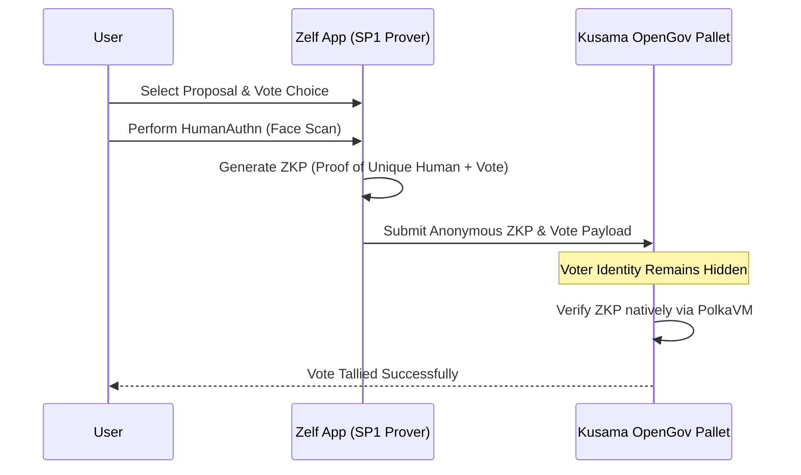
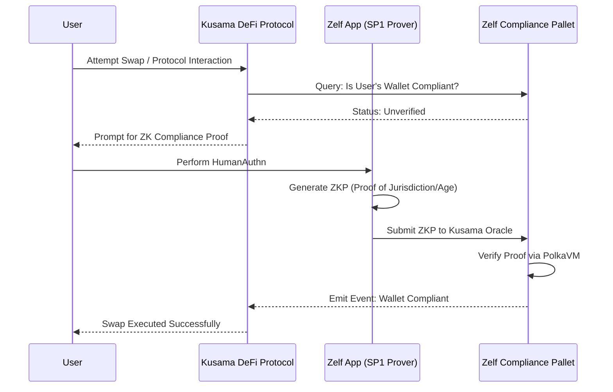
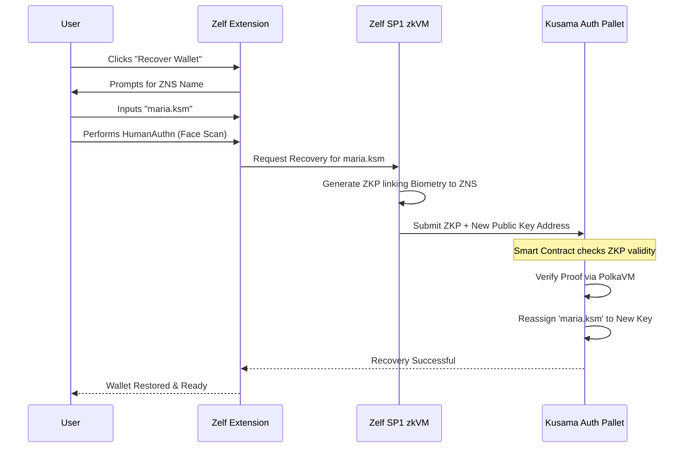
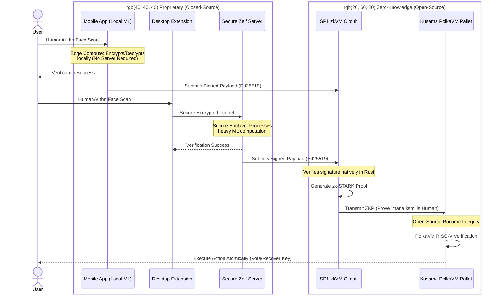

# Kusama ZK Bounty Proposal: Zelf ID & HumanAuthn

## 1. The Core Infrastructure: Decentralized Zelf ID (ZK Passport)

**Status:** _Perfect match for the bounty's "Selective Disclosure & ZK Identity" track._

Your foundational idea is exactly what Kusama is looking for. Zelf ID already utilizes HumanAuthn so biometrics are never saved. For Kusama, we extend this: Zelf generates a mathematical Zero-Knowledge Proof (ZKP) affirming the user's "Unique Personhood" or specific traits (e.g. "Over 18", "Not in US").
Instead of Kusama validating biometrics or reading passports, a runtime pallet or smart contract verifies this ZKP math. This provides bulletproof **Sybil Resistance** while maintaining 100% privacy.

---

## 2. Implementations & Use Cases of Zelf ID on Kusama

The remaining ideas are powerful real-world applications (use cases) that run _on top of_ the Zelf ID core. Here is how they apply to the bounty's target areas:

### Use Case A: Sybil-Resistant Private Governance (Kusama OpenGov)

**The Problem:** Blockchain voting is public, and "One Person, One Vote" fails because users can split tokens across wallets.
**The Zelf Solution:** Use the Zelf ID to generate a ZKP that allows a user to vote anonymously on Kusama OpenGov proposals. The network verifies the vote comes from a unique human without revealing _who_ that human is or linking the vote to their public wallet. This directly targets the **Private Governance** requirement in the bounty.

### Use Case B: Universal ZK Compliance & KYC (Private On-Ramp/DeFi)

_(This consolidates your "Decentralized KYC Chain?" idea)_
**The Problem:** Parachains and DeFi dApps want to comply with regulations, but users don't want to expose their identity or wallet balances to public ledgers. Building an entire separate L1 KYC chain is too much friction.
**The Zelf Solution:** Instead of a whole new chain, Zelf deploys a **ZK Compliance Smart Contract** or **Runtime Pallet** on Kusama. A DeFi protocol queries the contract: _"Is this wallet eligible to trade?"_ The user provides their Zelf ID ZKP, proving jurisdiction/KYC compliance without revealing their actual name or country.

### Use Case C: Biometric ZK Wallet Recovery via Zelf Name Service (ZNS)

_(Integrating your existing Zelf Name Service architecture into the Kusama ecosystem)_
**The Problem:** Seed phrases are a leading cause of funds lost, preventing mass adoption. While naming services exist, recovering the wallet attached to a name typically still relies on a seed phrase.
**The Zelf Solution:** Expand the existing **Zelf Name Service** (where users have `miguel.zelf` or seamlessly register `maria.ksm`) onto Kusama. Kusama acts as the decentralized "Key Management System" (DKMS). By doing HumanAuthn off-chain tied to their specific name string, the user generates a ZKP. The Kusama confidential smart contract verifies this proof and authorizes **wallet recovery** for that specific `.ksm` identity, or issues a temporary **Biometric Session Key**. Trust shifts entirely from insecure phrases to unforgeable math tied to a human-readable identity.

---

## 3. Technical Architecture & Cryptographic Stack

To leverage Kusama's ecosystem specifically, we will utilize **PolkaVM** natively for our ZK Proof verification. 
Traditional zero-knowledge development (like Circom/SnarkJS) requires writing bespoke mathematical circuits, which is slow and prone to security vulnerabilities. Instead, we are proposing a modern **zkVM (Zero-Knowledge Virtual Machine)** architecture. 

### 3.1 Framework Selection: RISC-V zkVMs (SP1 vs. RISC Zero)
Because Kusama's brand new runtime execution environment (PolkaVM) is based on the **RISC-V** instruction set, we will select a zkVM that natively compiles Rust code into RISC-V and proves it. 

Our primary candidate is **SP1 (by Succinct Labs)** (or alternatively **RISC Zero**). 
- **Why SP1?** SP1 is a 100% open-source, highly performant zkVM. It allows us to write the HumanAuthn verification payload logic in standard, auditable Rust. SP1 then compiles this Rust into RISC-V instructions and generates a STARK proof that the execution was completely valid.
- **Why this matters for Kusama:** Since the PolkaVM network natively understands RISC-V, deploying an on-chain verifier for an off-chain SP1 proof is incredibly idiomatic and highly optimized for the network. We aren't forcing foreign cryptography onto Kusama; we are speaking its native language.

### 3.2 The Integration Flow (Protecting the Secret Sauce)
The beauty of this architecture is that your proprietary algorithms remain 100% closed-source, while satisfying the blockchain's need for public verification.

1. **The Proprietary Environment (Closed-Source):**
    - The user conducts HumanAuthn.
    - **For Mobile (iOS/Android):** The proprietary binary runs entirely *on the user's local device*, processing the encryption and decryption without ever needing a server. This represents peak decentralized privacy.
    - **For Desktop (Wallet Extension):** Because browser extensions lack the heavy computational power required for the ML processing, a highly secured, encrypted communication tunnel is used to offload the computation to a secure server.
    - Ultimately, this environment outputs a signed payload (e.g., an Ed25519 signature saying `maria.ksm is verified`) signed by the proprietary Zelf keys.
2. **Off-Chain Proving (SP1 Rust Circuit - Open Source):**
    - The compiled SP1 Rust program takes that payload and signature as inputs. 
    - The entire job of the SP1 program is simply to mathematically verify: *"Did the official Zelf identity matrix sign this specific payload?"*
    - SP1 generates a ZK Proof of this verification.
3. **On-Chain Verification (Kusama Parachain/PolkaVM Pallet):**
    - The user submits the SP1 ZK Proof to Kusama.
    - The PolkaVM pallet natively verifies the ZK Proof. If valid, the state change (vote cast or keys recovered) executes atomically.

By structuring it this way, the Kusama community can publicly audit the open-source SP1 circuit, but your core ML, encryption, and biometric binaries never touch the SP1 environment—operating either locally on the user's mobile device or via a securely encrypted pipeline for desktop extensions.

### 3.3 Architecture Sequence Diagram
*(You can render this diagram to an image using any Markdown or Mermaid viewer)*

---

## 4. Milestones, Timeline, and Budget Proposal

_Note: The timeline is aggressively optimized (approx. 9 weeks total) by utilizing advanced AI generation (Claude Opus 4.6 / Gemini 3.1 Pro) for rapid boilerplate generation, mathematical circuit scaffolding, and Rust pallet implementation._

**Total Requested Budget:** 24,000 DOT (equivalent to ~$30,000 USD)  
**Total Estimated Timeline:** 9 Weeks

### Milestone 1: Zelf ID Core ZKP Generation & PolkaVM Verifier

**Focus:** Foundational Infrastructure
**Estimated Time:** 3 Weeks
**Proposed Budget:** 8,000 DOT (equivalent to ~$10,000 USD)
**Tasks:**

- [ ] Scaffold off-chain Risc-V ZK circuit integrating HumanAuthn auth-success payloads.
- [ ] Develop the PolkaVM optimized verifier pallet for Kusama runtimes.
- [ ] Create benchmark tests proving verification cost and speed on a local Kusama testnet.
- [ ] Deliverable: Open-source repository with end-to-end "Proof of Unique Human" generation and on-chain verification.

### Milestone 2: ZNS Wallet Recovery Integration (Use Case C)

**Focus:** Consumer UX & Wallet Ecosystem
**Estimated Time:** 3 Weeks
**Proposed Budget:** 8,000 DOT (equivalent to ~$10,000 USD)
**Tasks:**

- [ ] Map Zelf Name Service domains (`.ksm`) logically to Kusama wallets in the contract state.
- [ ] Build the "Biometric Key Recovery" smart contract logic using the Milestone 1 verifier.
- [ ] Implement the UI/UX within the Zelf Extension: Users input their name (e.g., `miguel.ksm`), perform HumanAuthn, and instantly recover signing capabilities via ZKP.
- [ ] Deliverable: Functional demonstration inside the Zelf Wallet Extension connecting to a Kusama test network.

### Milestone 3: Sybil-Resistant Governance & Compliance Connectors (Use Case A & B)

**Focus:** Ecosystem Adoption & Real-World Parachain Connectivity
**Estimated Time:** 3 Weeks
**Proposed Budget:** 8,000 DOT (equivalent to ~$10,000 USD)
**Tasks:**

- [ ] Build the "Private Vote Proxy" contract that allows an anonymous but ZKP-verified user to cast OpenGov votes.
- [ ] Build the "Compliance Oracle" endpoint where DeFi parachains can query KYC status securely.
- [ ] Comprehensive security auditing of the RISC-V verification logic and ZK circuits using AI-assisted fuzzing and manual review.
- [ ] Deliverable: Final production-ready open-source suite, deployed to Kusama/Rococo testnets, with comprehensive integration documentation for parachain developers.

---

## 5. Long-Term Strategy: The Licensing Angle

_(Internal Strategy for Zelf)_

By intentionally keeping the grant request low (**$30k total**), we create an irresistible "loss leader" for the Kusama treasury. They get a highly complex, natively compiled RISC-V ZK integration for a fraction of the market cost.

However, the open-source grant covers the **blockchain integration** (the PolkaVM Pallets, Smart Contracts, and ZK Circuits). The underlying proprietary HumanAuthn biometric processing and API infrastructure remains closed-source.
Once Kusama parachains are hooked on the integration, Zelf can propose a **Yearly Service Level Agreement (SLA) & Enterprise License** (e.g., $50,000-$100,000/year to the Kusama Treasury) to maintain the API infrastructure, cover computation costs for the ZK generation, and guarantee uptime for all parachains relying on the tech.

---

## 6. Extension UI Implementation (Wallet Recovery Flow)

Based on the actual component architecture of the `verifik-wallet-extension`, the integration of the **ZNS Biometric ZK Wallet Recovery** will be remarkably seamless. We will leverage existing UI components while piping the data into the Kusama-specific cryptographic logic.

Here is the step-by-step UX flow:

1. **The Entry Point (`welcome-find` / `welcome-recover`)**
   - We will extend the primary input field to gracefully support `.ksm` domains resolving via our Kusama Pallet, alongside the existing `.zelf` logic.
   - The user inputs `maria.ksm` and clicks "Recover via Face ID".
2. **The Biometric Challenge (`security-biometrics` & `biometrics-general`)**
   - The UI seamlessly transitions to the existing HumanAuthn camera interface. 
   - Following your secure architecture, the ML computation is piped via the encrypted tunnel to the Secure Enclave server.
   - Upon successful liveness and identity match, the server returns the signed authentication payload to the extension.
3. **Zero-Knowledge Generation (`zelf-loader` / `zelf-pending`)**
   - Instead of a traditional generic loader, the user sees a specialized ZK processing state.
   - **UI Text:** *"Generating Zero-Knowledge Proof... Securely mapping maria.ksm without revealing biometrics."*
4. **On-Chain Assignment (Background RPC)**
   - The extension generates a brand new KeyPair locally inside the vault.
   - It submits the new Public Key + the generated SP1 ZK Proof to the Kusama RPC endpoint.
   - The Kusama DKMS contract natively verifies the ZK Proof and securely locks `maria.ksm` to this newly generated KeyPair.
5. **The Success State (`reserve-done-sheet`)**
   - The recovery completes. The user is presented with the standard success modal modified with Kusama branding.
   - **UI Text:** *"Wallet Recovered! The '.ksm' identity has been securely mapped to your new device."*

By reusing and lightly modifying the established `welcome-*`, `security-*`, and `reserve-done-sheet` Component structures, we minimize technical debt while introducing world-class zero-knowledge recovery to the end user.

---

## 7. Next Immediate TODOs for the Team

- [ ] Render the Mermaid diagrams from this document and export them as high-quality SVGs for the final proposal.
- [ ] Review and lock in the 24,000 DOT ($30k USD) budget + 9 Week Timeline parameters.
- [ ] Formalize this draft into the final Kusama Treasury / Bounty portal format.
